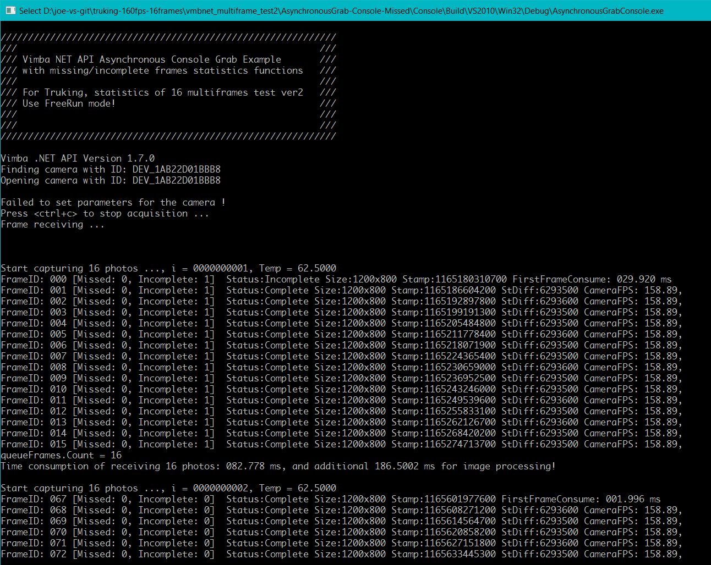

Vimba .NET 图像采集状态统计例程 - vmbnet_freerun_missing_frames_statistics - FreeRun 版本
---

# 简介

FreeRun Mode version:  
VimbaNET_Examples\AsynchronousGrab-Console Example with missing/incomplete frames counting functions.  
基于VimbaNET_Examples\AsynchronousGrab-Console例程，增加图像接收统计功能。  
通过每张图片的连续递增序号以及每张图片的状态值来判断丢失或者不完整的图片数量。  

每次取图16张。 


# 相机参数设置
在相机缺省参数基础上，需要设置如下参数
* `AcquisitionMode`: `Continuous`


# Visual Studio 设置
此程序使用了`OpenCvSharp`组件。
可以使用Visual Studio 2017或者更高版本，从NuGet中安装 `OpenCvSharp` 组件。
https://github.com/shimat/opencvsharp  
使用方法：https://blog.csdn.net/bayinglong/article/details/84258687


# 例程使用说明


* FrameID: 自从相机上电运行后，每一张图片都具有一个连续递增的序列号。
* Missed: 已经累积丢失的图片数量。
* Incomplete: 已经累积收到的不完整图片数量。  
        例如，下面是主要的采图失败状态码：  
        `VmbFrameStatusFault = -4,`  
        `VmbFrameStatusInvalid = -3,`   
        `VmbFrameStatusTooSmall = -2,`    
        `VmbFrameStatusIncomplete = -1,`  
        `VmbFrameStatusComplete = 0`  
* Stamp: 相机拍摄图片时的时间戳，也就是相机感光芯片直接成像的时刻。
* StDiff: 与前一张图片时间戳的差。


# 代码及编译  
## 基于下面代码
在这里：https://github.com/avtcn/vmbnet_freerun_missing_frames_statistics
## 编译运行
可以使用[Visual Studio 2010](https://visualstudio.microsoft.com/) 或者更高版本，Vimba SDK 建议使用 [2.1.3或者更高版本](https://www.alliedvision.com/en/products/software.html)。
## 运行结果
```


/////////////////////////////////////////////////////////////
///                                                       ///
/// Vimba NET API Asynchronous Console Grab Example       ///
/// with missing/incomplete frames statistics functions   ///
///                                                       ///
/// For Truking, statistics of 16 multiframes test ver2   ///
/// Use FreeRun mode!                                     ///
///                                                       ///
///                                                       ///
/////////////////////////////////////////////////////////////

Vimba .NET API Version 1.7.0
Finding camera with ID: DEV_1AB22D01BBB8
Opening camera with ID: DEV_1AB22D01BBB8

Failed to set parameters for the camera !
Press <ctrl+c> to stop acquisition ...
Frame receiving ...


Start capturing 16 photos ..., i = 0000000001, Temp = 62.5000
FrameID: 000 [Missed: 0, Incomplete: 1]  Status:Incomplete Size:1200x800 Stamp:1165180310700 FirstFrameConsume: 029.920 ms
FrameID: 001 [Missed: 0, Incomplete: 1]  Status:Complete Size:1200x800 Stamp:1165186604200 StDiff:6293500 CameraFPS: 158.89,
FrameID: 002 [Missed: 0, Incomplete: 1]  Status:Complete Size:1200x800 Stamp:1165192897800 StDiff:6293600 CameraFPS: 158.89,
FrameID: 003 [Missed: 0, Incomplete: 1]  Status:Complete Size:1200x800 Stamp:1165199191300 StDiff:6293500 CameraFPS: 158.89,
FrameID: 004 [Missed: 0, Incomplete: 1]  Status:Complete Size:1200x800 Stamp:1165205484800 StDiff:6293500 CameraFPS: 158.89,
FrameID: 005 [Missed: 0, Incomplete: 1]  Status:Complete Size:1200x800 Stamp:1165211778400 StDiff:6293600 CameraFPS: 158.89,
FrameID: 006 [Missed: 0, Incomplete: 1]  Status:Complete Size:1200x800 Stamp:1165218071900 StDiff:6293500 CameraFPS: 158.89,
FrameID: 007 [Missed: 0, Incomplete: 1]  Status:Complete Size:1200x800 Stamp:1165224365400 StDiff:6293500 CameraFPS: 158.89,
FrameID: 008 [Missed: 0, Incomplete: 1]  Status:Complete Size:1200x800 Stamp:1165230659000 StDiff:6293600 CameraFPS: 158.89,
FrameID: 009 [Missed: 0, Incomplete: 1]  Status:Complete Size:1200x800 Stamp:1165236952500 StDiff:6293500 CameraFPS: 158.89,
FrameID: 010 [Missed: 0, Incomplete: 1]  Status:Complete Size:1200x800 Stamp:1165243246000 StDiff:6293500 CameraFPS: 158.89,
FrameID: 011 [Missed: 0, Incomplete: 1]  Status:Complete Size:1200x800 Stamp:1165249539600 StDiff:6293600 CameraFPS: 158.89,
FrameID: 012 [Missed: 0, Incomplete: 1]  Status:Complete Size:1200x800 Stamp:1165255833100 StDiff:6293500 CameraFPS: 158.89,
FrameID: 013 [Missed: 0, Incomplete: 1]  Status:Complete Size:1200x800 Stamp:1165262126700 StDiff:6293600 CameraFPS: 158.89,
FrameID: 014 [Missed: 0, Incomplete: 1]  Status:Complete Size:1200x800 Stamp:1165268420200 StDiff:6293500 CameraFPS: 158.89,
FrameID: 015 [Missed: 0, Incomplete: 1]  Status:Complete Size:1200x800 Stamp:1165274713700 StDiff:6293500 CameraFPS: 158.89,
queueFrames.Count = 16
Time consumption of receiving 16 photos: 082.778 ms, and additional 186.5002 ms for image processing!

Start capturing 16 photos ..., i = 0000000002, Temp = 62.5000
FrameID: 067 [Missed: 0, Incomplete: 0]  Status:Complete Size:1200x800 Stamp:1165601977600 FirstFrameConsume: 001.996 ms
FrameID: 068 [Missed: 0, Incomplete: 0]  Status:Complete Size:1200x800 Stamp:1165608271200 StDiff:6293600 CameraFPS: 158.89,
FrameID: 069 [Missed: 0, Incomplete: 0]  Status:Complete Size:1200x800 Stamp:1165614564700 StDiff:6293500 CameraFPS: 158.89,
FrameID: 070 [Missed: 0, Incomplete: 0]  Status:Complete Size:1200x800 Stamp:1165620858200 StDiff:6293500 CameraFPS: 158.89,
FrameID: 071 [Missed: 0, Incomplete: 0]  Status:Complete Size:1200x800 Stamp:1165627151800 StDiff:6293600 CameraFPS: 158.89,
FrameID: 072 [Missed: 0, Incomplete: 0]  Status:Complete Size:1200x800 Stamp:1165633445300 StDiff:6293500 CameraFPS: 158.89,
FrameID: 073 [Missed: 0, Incomplete: 0]  Status:Complete Size:1200x800 Stamp:1165639738800 StDiff:6293500 CameraFPS: 158.89,
FrameID: 074 [Missed: 0, Incomplete: 0]  Status:Complete Size:1200x800 Stamp:1165646032400 StDiff:6293600 CameraFPS: 158.89,
FrameID: 075 [Missed: 0, Incomplete: 0]  Status:Complete Size:1200x800 Stamp:1165652325900 StDiff:6293500 CameraFPS: 158.89,
FrameID: 076 [Missed: 0, Incomplete: 0]  Status:Complete Size:1200x800 Stamp:1165658619400 StDiff:6293500 CameraFPS: 158.89,
FrameID: 077 [Missed: 0, Incomplete: 0]  Status:Complete Size:1200x800 Stamp:1165664913000 StDiff:6293600 CameraFPS: 158.89,
FrameID: 078 [Missed: 0, Incomplete: 0]  Status:Complete Size:1200x800 Stamp:1165671206500 StDiff:6293500 CameraFPS: 158.89,
FrameID: 079 [Missed: 0, Incomplete: 0]  Status:Complete Size:1200x800 Stamp:1165677500000 StDiff:6293500 CameraFPS: 158.89,
FrameID: 080 [Missed: 0, Incomplete: 0]  Status:Complete Size:1200x800 Stamp:1165683793600 StDiff:6293600 CameraFPS: 158.89,
FrameID: 081 [Missed: 0, Incomplete: 0]  Status:Complete Size:1200x800 Stamp:1165690087100 StDiff:6293500 CameraFPS: 158.89,
FrameID: 082 [Missed: 0, Incomplete: 0]  Status:Complete Size:1200x800 Stamp:1165696380700 StDiff:6293600 CameraFPS: 158.89,
queueFrames.Count = 16
Time consumption of receiving 16 photos: 107.716 ms, and additional 74.7995 ms for image processing!

Start capturing 16 photos ..., i = 0000000003, Temp = 62.5000
FrameID: 131 [Missed: 0, Incomplete: 0]  Status:Complete Size:1200x800 Stamp:1166004764000 FirstFrameConsume: 003.989 ms
FrameID: 132 [Missed: 0, Incomplete: 0]  Status:Complete Size:1200x800 Stamp:1166011057500 StDiff:6293500 CameraFPS: 158.89,
FrameID: 133 [Missed: 0, Incomplete: 0]  Status:Complete Size:1200x800 Stamp:1166017351000 StDiff:6293500 CameraFPS: 158.89,
FrameID: 134 [Missed: 0, Incomplete: 0]  Status:Complete Size:1200x800 Stamp:1166023644600 StDiff:6293600 CameraFPS: 158.89,
FrameID: 135 [Missed: 0, Incomplete: 0]  Status:Complete Size:1200x800 Stamp:1166029938100 StDiff:6293500 CameraFPS: 158.89,
FrameID: 136 [Missed: 0, Incomplete: 0]  Status:Complete Size:1200x800 Stamp:1166036231600 StDiff:6293500 CameraFPS: 158.89,
FrameID: 137 [Missed: 0, Incomplete: 0]  Status:Complete Size:1200x800 Stamp:1166042525200 StDiff:6293600 CameraFPS: 158.89,
FrameID: 138 [Missed: 0, Incomplete: 0]  Status:Complete Size:1200x800 Stamp:1166048818700 StDiff:6293500 CameraFPS: 158.89,
FrameID: 139 [Missed: 0, Incomplete: 0]  Status:Complete Size:1200x800 Stamp:1166055112200 StDiff:6293500 CameraFPS: 158.89,
FrameID: 140 [Missed: 0, Incomplete: 0]  Status:Complete Size:1200x800 Stamp:1166061405800 StDiff:6293600 CameraFPS: 158.89,
FrameID: 141 [Missed: 0, Incomplete: 0]  Status:Complete Size:1200x800 Stamp:1166067699300 StDiff:6293500 CameraFPS: 158.89,
FrameID: 142 [Missed: 0, Incomplete: 0]  Status:Complete Size:1200x800 Stamp:1166073992800 StDiff:6293500 CameraFPS: 158.89,
FrameID: 143 [Missed: 0, Incomplete: 0]  Status:Complete Size:1200x800 Stamp:1166080286400 StDiff:6293600 CameraFPS: 158.89,
FrameID: 144 [Missed: 0, Incomplete: 0]  Status:Complete Size:1200x800 Stamp:1166086579900 StDiff:6293500 CameraFPS: 158.89,
FrameID: 145 [Missed: 0, Incomplete: 0]  Status:Complete Size:1200x800 Stamp:1166092873400 StDiff:6293500 CameraFPS: 158.89,
FrameID: 146 [Missed: 0, Incomplete: 0]  Status:Complete Size:1200x800 Stamp:1166099167000 StDiff:6293600 CameraFPS: 158.89,
queueFrames.Count = 16
Time consumption of receiving 16 photos: 098.736 ms, and additional 71.8085 ms for image processing!

Start capturing 16 photos ..., i = 0000000004, Temp = 62.5000
FrameID: 195 [Missed: 0, Incomplete: 0]  Status:Complete Size:1200x800 Stamp:1166407550200 FirstFrameConsume: 004.989 ms
FrameID: 196 [Missed: 0, Incomplete: 0]  Status:Complete Size:1200x800 Stamp:1166413843800 StDiff:6293600 CameraFPS: 158.89,
FrameID: 197 [Missed: 0, Incomplete: 0]  Status:Complete Size:1200x800 Stamp:1166420137300 StDiff:6293500 CameraFPS: 158.89,
FrameID: 198 [Missed: 0, Incomplete: 0]  Status:Complete Size:1200x800 Stamp:1166426430900 StDiff:6293600 CameraFPS: 158.89,
FrameID: 199 [Missed: 0, Incomplete: 0]  Status:Complete Size:1200x800 Stamp:1166432724400 StDiff:6293500 CameraFPS: 158.89,
FrameID: 200 [Missed: 0, Incomplete: 0]  Status:Complete Size:1200x800 Stamp:1166439018000 StDiff:6293600 CameraFPS: 158.89,
FrameID: 201 [Missed: 0, Incomplete: 0]  Status:Complete Size:1200x800 Stamp:1166445311500 StDiff:6293500 CameraFPS: 158.89,
FrameID: 202 [Missed: 0, Incomplete: 0]  Status:Complete Size:1200x800 Stamp:1166451605000 StDiff:6293500 CameraFPS: 158.89,
FrameID: 203 [Missed: 0, Incomplete: 0]  Status:Complete Size:1200x800 Stamp:1166457898600 StDiff:6293600 CameraFPS: 158.89,
FrameID: 204 [Missed: 0, Incomplete: 0]  Status:Complete Size:1200x800 Stamp:1166464192100 StDiff:6293500 CameraFPS: 158.89,
FrameID: 205 [Missed: 0, Incomplete: 0]  Status:Complete Size:1200x800 Stamp:1166470485600 StDiff:6293500 CameraFPS: 158.89,
FrameID: 206 [Missed: 0, Incomplete: 0]  Status:Complete Size:1200x800 Stamp:1166476779200 StDiff:6293600 CameraFPS: 158.89,
FrameID: 207 [Missed: 0, Incomplete: 0]  Status:Complete Size:1200x800 Stamp:1166483072700 StDiff:6293500 CameraFPS: 158.89,
FrameID: 208 [Missed: 0, Incomplete: 0]  Status:Complete Size:1200x800 Stamp:1166489366200 StDiff:6293500 CameraFPS: 158.89,
FrameID: 209 [Missed: 0, Incomplete: 0]  Status:Complete Size:1200x800 Stamp:1166495659800 StDiff:6293600 CameraFPS: 158.89,
FrameID: 210 [Missed: 0, Incomplete: 0]  Status:Complete Size:1200x800 Stamp:1166501953300 StDiff:6293500 CameraFPS: 158.89,
queueFrames.Count = 16
Time consumption of receiving 16 photos: 098.736 ms, and additional 49.8672 ms for image processing!

Start capturing 16 photos ..., i = 0000000005, Temp = 62.5000
FrameID: 259 [Missed: 0, Incomplete: 0]  Status:Complete Size:1200x800 Stamp:1166810336600 FirstFrameConsume: 005.986 ms
FrameID: 260 [Missed: 0, Incomplete: 0]  Status:Complete Size:1200x800 Stamp:1166816630100 StDiff:6293500 CameraFPS: 158.89,
FrameID: 261 [Missed: 0, Incomplete: 0]  Status:Complete Size:1200x800 Stamp:1166822923600 StDiff:6293500 CameraFPS: 158.89,
FrameID: 262 [Missed: 0, Incomplete: 0]  Status:Complete Size:1200x800 Stamp:1166829217200 StDiff:6293600 CameraFPS: 158.89,
FrameID: 263 [Missed: 0, Incomplete: 0]  Status:Complete Size:1200x800 Stamp:1166835510700 StDiff:6293500 CameraFPS: 158.89,
FrameID: 264 [Missed: 0, Incomplete: 0]  Status:Complete Size:1200x800 Stamp:1166841804200 StDiff:6293500 CameraFPS: 158.89,
FrameID: 265 [Missed: 0, Incomplete: 0]  Status:Complete Size:1200x800 Stamp:1166848097800 StDiff:6293600 CameraFPS: 158.89,
FrameID: 266 [Missed: 0, Incomplete: 0]  Status:Complete Size:1200x800 Stamp:1166854391300 StDiff:6293500 CameraFPS: 158.89,
FrameID: 267 [Missed: 0, Incomplete: 0]  Status:Complete Size:1200x800 Stamp:1166860684900 StDiff:6293600 CameraFPS: 158.89,
FrameID: 268 [Missed: 0, Incomplete: 0]  Status:Complete Size:1200x800 Stamp:1166866978400 StDiff:6293500 CameraFPS: 158.89,
FrameID: 269 [Missed: 0, Incomplete: 0]  Status:Complete Size:1200x800 Stamp:1166873272000 StDiff:6293600 CameraFPS: 158.89,
FrameID: 270 [Missed: 0, Incomplete: 0]  Status:Complete Size:1200x800 Stamp:1166879565500 StDiff:6293500 CameraFPS: 158.89,
FrameID: 271 [Missed: 0, Incomplete: 0]  Status:Complete Size:1200x800 Stamp:1166885859000 StDiff:6293500 CameraFPS: 158.89,
FrameID: 272 [Missed: 0, Incomplete: 0]  Status:Complete Size:1200x800 Stamp:1166892152600 StDiff:6293600 CameraFPS: 158.89,
FrameID: 273 [Missed: 0, Incomplete: 0]  Status:Complete Size:1200x800 Stamp:1166898446100 StDiff:6293500 CameraFPS: 158.89,
FrameID: 274 [Missed: 0, Incomplete: 0]  Status:Complete Size:1200x800 Stamp:1166904739600 StDiff:6293500 CameraFPS: 158.89,
queueFrames.Count = 16
Time consumption of receiving 16 photos: 100.731 ms, and additional 41.887 ms for image processing!

Start capturing 16 photos ..., i = 0000000006, Temp = 62.5000
FrameID: 322 [Missed: 0, Incomplete: 0]  Status:Complete Size:1200x800 Stamp:1167206829400 FirstFrameConsume: 001.994 ms
FrameID: 323 [Missed: 0, Incomplete: 0]  Status:Complete Size:1200x800 Stamp:1167213122900 StDiff:6293500 CameraFPS: 158.89,
FrameID: 324 [Missed: 0, Incomplete: 0]  Status:Complete Size:1200x800 Stamp:1167219416400 StDiff:6293500 CameraFPS: 158.89,
FrameID: 325 [Missed: 0, Incomplete: 0]  Status:Complete Size:1200x800 Stamp:1167225710000 StDiff:6293600 CameraFPS: 158.89,
FrameID: 326 [Missed: 0, Incomplete: 0]  Status:Complete Size:1200x800 Stamp:1167232003500 StDiff:6293500 CameraFPS: 158.89,
FrameID: 327 [Missed: 0, Incomplete: 0]  Status:Complete Size:1200x800 Stamp:1167238297000 StDiff:6293500 CameraFPS: 158.89,
FrameID: 328 [Missed: 0, Incomplete: 0]  Status:Complete Size:1200x800 Stamp:1167244590600 StDiff:6293600 CameraFPS: 158.89,
FrameID: 329 [Missed: 0, Incomplete: 0]  Status:Complete Size:1200x800 Stamp:1167250884100 StDiff:6293500 CameraFPS: 158.89,
FrameID: 330 [Missed: 0, Incomplete: 0]  Status:Complete Size:1200x800 Stamp:1167257177600 StDiff:6293500 CameraFPS: 158.89,
FrameID: 331 [Missed: 0, Incomplete: 0]  Status:Complete Size:1200x800 Stamp:1167263471200 StDiff:6293600 CameraFPS: 158.89,
FrameID: 332 [Missed: 0, Incomplete: 0]  Status:Complete Size:1200x800 Stamp:1167269764700 StDiff:6293500 CameraFPS: 158.89,
FrameID: 333 [Missed: 0, Incomplete: 0]  Status:Complete Size:1200x800 Stamp:1167276058200 StDiff:6293500 CameraFPS: 158.89,
FrameID: 334 [Missed: 0, Incomplete: 0]  Status:Complete Size:1200x800 Stamp:1167282351800 StDiff:6293600 CameraFPS: 158.89,
FrameID: 335 [Missed: 0, Incomplete: 0]  Status:Complete Size:1200x800 Stamp:1167288645300 StDiff:6293500 CameraFPS: 158.89,
FrameID: 336 [Missed: 0, Incomplete: 0]  Status:Complete Size:1200x800 Stamp:1167294938900 StDiff:6293600 CameraFPS: 158.89,
FrameID: 337 [Missed: 0, Incomplete: 0]  Status:Complete Size:1200x800 Stamp:1167301232400 StDiff:6293500 CameraFPS: 158.89,
queueFrames.Count = 16
Time consumption of receiving 16 photos: 098.735 ms, and additional 64.8268 ms for image processing!

Start capturing 16 photos ..., i = 0000000007, Temp = 62.5000
FrameID: 386 [Missed: 0, Incomplete: 0]  Status:Complete Size:1200x800 Stamp:1167609615700 FirstFrameConsume: 002.992 ms
FrameID: 387 [Missed: 0, Incomplete: 0]  Status:Complete Size:1200x800 Stamp:1167615909200 StDiff:6293500 CameraFPS: 158.89,
FrameID: 388 [Missed: 0, Incomplete: 0]  Status:Complete Size:1200x800 Stamp:1167622202800 StDiff:6293600 CameraFPS: 158.89,
FrameID: 389 [Missed: 0, Incomplete: 0]  Status:Complete Size:1200x800 Stamp:1167628496300 StDiff:6293500 CameraFPS: 158.89,
FrameID: 390 [Missed: 0, Incomplete: 0]  Status:Complete Size:1200x800 Stamp:1167634789800 StDiff:6293500 CameraFPS: 158.89,
FrameID: 391 [Missed: 0, Incomplete: 0]  Status:Complete Size:1200x800 Stamp:1167641083400 StDiff:6293600 CameraFPS: 158.89,
FrameID: 392 [Missed: 0, Incomplete: 0]  Status:Complete Size:1200x800 Stamp:1167647376900 StDiff:6293500 CameraFPS: 158.89,
FrameID: 393 [Missed: 0, Incomplete: 0]  Status:Complete Size:1200x800 Stamp:1167653670400 StDiff:6293500 CameraFPS: 158.89,
FrameID: 394 [Missed: 0, Incomplete: 0]  Status:Complete Size:1200x800 Stamp:1167659964000 StDiff:6293600 CameraFPS: 158.89,
FrameID: 395 [Missed: 0, Incomplete: 0]  Status:Complete Size:1200x800 Stamp:1167666257500 StDiff:6293500 CameraFPS: 158.89,
FrameID: 396 [Missed: 0, Incomplete: 0]  Status:Complete Size:1200x800 Stamp:1167672551000 StDiff:6293500 CameraFPS: 158.89,
FrameID: 397 [Missed: 0, Incomplete: 0]  Status:Complete Size:1200x800 Stamp:1167678844600 StDiff:6293600 CameraFPS: 158.89,
FrameID: 398 [Missed: 0, Incomplete: 0]  Status:Complete Size:1200x800 Stamp:1167685138100 StDiff:6293500 CameraFPS: 158.89,
FrameID: 399 [Missed: 0, Incomplete: 0]  Status:Complete Size:1200x800 Stamp:1167691431600 StDiff:6293500 CameraFPS: 158.89,
FrameID: 400 [Missed: 0, Incomplete: 0]  Status:Complete Size:1200x800 Stamp:1167697725200 StDiff:6293600 CameraFPS: 158.89,
FrameID: 401 [Missed: 0, Incomplete: 0]  Status:Complete Size:1200x800 Stamp:1167704018700 StDiff:6293500 CameraFPS: 158.89,
queueFrames.Count = 16
Time consumption of receiving 16 photos: 096.742 ms, and additional 63.8298 ms for image processing!

Start capturing 16 photos ..., i = 0000000008, Temp = 62.5000
FrameID: 450 [Missed: 0, Incomplete: 0]  Status:Complete Size:1200x800 Stamp:1168012402000 FirstFrameConsume: 003.990 ms
FrameID: 451 [Missed: 0, Incomplete: 0]  Status:Complete Size:1200x800 Stamp:1168018695500 StDiff:6293500 CameraFPS: 158.89,
FrameID: 452 [Missed: 0, Incomplete: 0]  Status:Complete Size:1200x800 Stamp:1168024989100 StDiff:6293600 CameraFPS: 158.89,
FrameID: 453 [Missed: 0, Incomplete: 0]  Status:Complete Size:1200x800 Stamp:1168031282600 StDiff:6293500 CameraFPS: 158.89,
FrameID: 454 [Missed: 0, Incomplete: 0]  Status:Complete Size:1200x800 Stamp:1168037576200 StDiff:6293600 CameraFPS: 158.89,
FrameID: 455 [Missed: 0, Incomplete: 0]  Status:Complete Size:1200x800 Stamp:1168043869700 StDiff:6293500 CameraFPS: 158.89,
FrameID: 456 [Missed: 0, Incomplete: 0]  Status:Complete Size:1200x800 Stamp:1168050163200 StDiff:6293500 CameraFPS: 158.89,
FrameID: 457 [Missed: 0, Incomplete: 0]  Status:Complete Size:1200x800 Stamp:1168056456800 StDiff:6293600 CameraFPS: 158.89,
FrameID: 458 [Missed: 0, Incomplete: 0]  Status:Complete Size:1200x800 Stamp:1168062750300 StDiff:6293500 CameraFPS: 158.89,
FrameID: 459 [Missed: 0, Incomplete: 0]  Status:Complete Size:1200x800 Stamp:1168069043800 StDiff:6293500 CameraFPS: 158.89,
FrameID: 460 [Missed: 0, Incomplete: 0]  Status:Complete Size:1200x800 Stamp:1168075337400 StDiff:6293600 CameraFPS: 158.89,
FrameID: 461 [Missed: 0, Incomplete: 0]  Status:Complete Size:1200x800 Stamp:1168081630900 StDiff:6293500 CameraFPS: 158.89,
FrameID: 462 [Missed: 0, Incomplete: 0]  Status:Complete Size:1200x800 Stamp:1168087924400 StDiff:6293500 CameraFPS: 158.89,
FrameID: 463 [Missed: 0, Incomplete: 0]  Status:Complete Size:1200x800 Stamp:1168094218000 StDiff:6293600 CameraFPS: 158.89,
FrameID: 464 [Missed: 0, Incomplete: 0]  Status:Complete Size:1200x800 Stamp:1168100511500 StDiff:6293500 CameraFPS: 158.89,
FrameID: 465 [Missed: 0, Incomplete: 0]  Status:Complete Size:1200x800 Stamp:1168106805000 StDiff:6293500 CameraFPS: 158.89,
queueFrames.Count = 16
Time consumption of receiving 16 photos: 098.736 ms, and additional 55.8519 ms for image processing!

Start capturing 16 photos ..., i = 0000000009, Temp = 62.5000
FrameID: 514 [Missed: 0, Incomplete: 0]  Status:Complete Size:1200x800 Stamp:1168415188300 FirstFrameConsume: 005.987 ms
FrameID: 515 [Missed: 0, Incomplete: 0]  Status:Complete Size:1200x800 Stamp:1168421481800 StDiff:6293500 CameraFPS: 158.89,
FrameID: 516 [Missed: 0, Incomplete: 0]  Status:Complete Size:1200x800 Stamp:1168427775400 StDiff:6293600 CameraFPS: 158.89,
FrameID: 517 [Missed: 0, Incomplete: 0]  Status:Complete Size:1200x800 Stamp:1168434068900 StDiff:6293500 CameraFPS: 158.89,
FrameID: 518 [Missed: 0, Incomplete: 0]  Status:Complete Size:1200x800 Stamp:1168440362500 StDiff:6293600 CameraFPS: 158.89,
FrameID: 519 [Missed: 0, Incomplete: 0]  Status:Complete Size:1200x800 Stamp:1168446656000 StDiff:6293500 CameraFPS: 158.89,
FrameID: 520 [Missed: 0, Incomplete: 0]  Status:Complete Size:1200x800 Stamp:1168452949500 StDiff:6293500 CameraFPS: 158.89,
FrameID: 521 [Missed: 0, Incomplete: 0]  Status:Complete Size:1200x800 Stamp:1168459243100 StDiff:6293600 CameraFPS: 158.89,
FrameID: 522 [Missed: 0, Incomplete: 0]  Status:Complete Size:1200x800 Stamp:1168465536600 StDiff:6293500 CameraFPS: 158.89,
FrameID: 523 [Missed: 0, Incomplete: 0]  Status:Complete Size:1200x800 Stamp:1168471830200 StDiff:6293600 CameraFPS: 158.89,
FrameID: 524 [Missed: 0, Incomplete: 0]  Status:Complete Size:1200x800 Stamp:1168478123700 StDiff:6293500 CameraFPS: 158.89,
FrameID: 525 [Missed: 0, Incomplete: 0]  Status:Complete Size:1200x800 Stamp:1168484417200 StDiff:6293500 CameraFPS: 158.89,
FrameID: 526 [Missed: 0, Incomplete: 0]  Status:Complete Size:1200x800 Stamp:1168490710800 StDiff:6293600 CameraFPS: 158.89,
FrameID: 527 [Missed: 0, Incomplete: 0]  Status:Complete Size:1200x800 Stamp:1168497004300 StDiff:6293500 CameraFPS: 158.89,
FrameID: 528 [Missed: 0, Incomplete: 0]  Status:Complete Size:1200x800 Stamp:1168503297800 StDiff:6293500 CameraFPS: 158.89,
FrameID: 529 [Missed: 0, Incomplete: 0]  Status:Complete Size:1200x800 Stamp:1168509591400 StDiff:6293600 CameraFPS: 158.89,
queueFrames.Count = 16
Time consumption of receiving 16 photos: 099.735 ms, and additional 59.8406 ms for image processing!

Start capturing 16 photos ..., i = 0000000010, Temp = 62.5000
FrameID: 577 [Missed: 0, Incomplete: 0]  Status:Complete Size:1200x800 Stamp:1168811681100 FirstFrameConsume: 005.986 ms
FrameID: 578 [Missed: 0, Incomplete: 0]  Status:Complete Size:1200x800 Stamp:1168817974600 StDiff:6293500 CameraFPS: 158.89,
FrameID: 579 [Missed: 0, Incomplete: 0]  Status:Complete Size:1200x800 Stamp:1168824268200 StDiff:6293600 CameraFPS: 158.89,
FrameID: 580 [Missed: 0, Incomplete: 0]  Status:Complete Size:1200x800 Stamp:1168830561700 StDiff:6293500 CameraFPS: 158.89,
FrameID: 581 [Missed: 0, Incomplete: 0]  Status:Complete Size:1200x800 Stamp:1168836855200 StDiff:6293500 CameraFPS: 158.89,
FrameID: 582 [Missed: 0, Incomplete: 0]  Status:Complete Size:1200x800 Stamp:1168843148800 StDiff:6293600 CameraFPS: 158.89,
FrameID: 583 [Missed: 0, Incomplete: 0]  Status:Complete Size:1200x800 Stamp:1168849442300 StDiff:6293500 CameraFPS: 158.89,
FrameID: 584 [Missed: 0, Incomplete: 0]  Status:Complete Size:1200x800 Stamp:1168855735800 StDiff:6293500 CameraFPS: 158.89,
FrameID: 585 [Missed: 0, Incomplete: 0]  Status:Complete Size:1200x800 Stamp:1168862029400 StDiff:6293600 CameraFPS: 158.89,
FrameID: 586 [Missed: 0, Incomplete: 0]  Status:Complete Size:1200x800 Stamp:1168868322900 StDiff:6293500 CameraFPS: 158.89,
FrameID: 587 [Missed: 0, Incomplete: 0]  Status:Complete Size:1200x800 Stamp:1168874616500 StDiff:6293600 CameraFPS: 158.89,
FrameID: 588 [Missed: 0, Incomplete: 0]  Status:Complete Size:1200x800 Stamp:1168880910000 StDiff:6293500 CameraFPS: 158.89,
FrameID: 589 [Missed: 0, Incomplete: 0]  Status:Complete Size:1200x800 Stamp:1168887203500 StDiff:6293500 CameraFPS: 158.89,
FrameID: 590 [Missed: 0, Incomplete: 0]  Status:Complete Size:1200x800 Stamp:1168893497100 StDiff:6293600 CameraFPS: 158.89,
FrameID: 591 [Missed: 0, Incomplete: 0]  Status:Complete Size:1200x800 Stamp:1168899790600 StDiff:6293500 CameraFPS: 158.89,
FrameID: 592 [Missed: 0, Incomplete: 0]  Status:Complete Size:1200x800 Stamp:1168906084200 StDiff:6293600 CameraFPS: 158.89,
queueFrames.Count = 16
Time consumption of receiving 16 photos: 096.515 ms, and additional 31.9143 ms for image processing!


```


